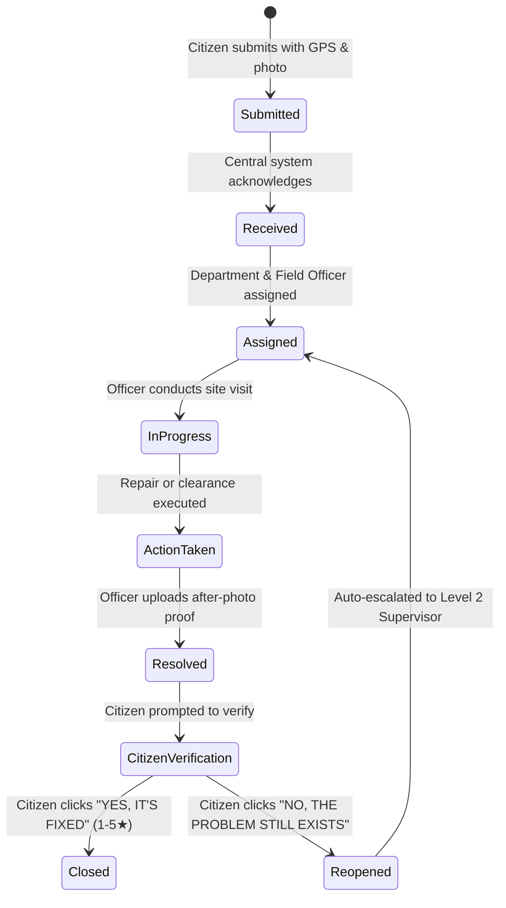
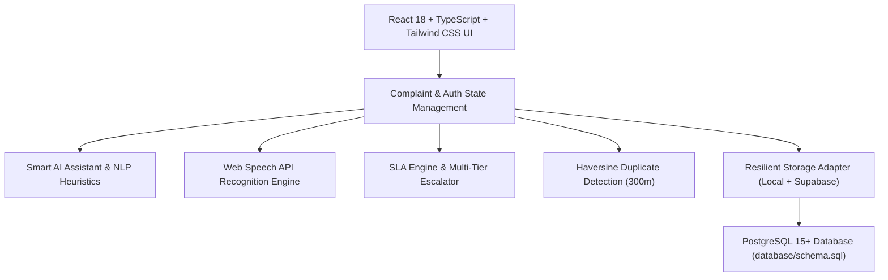

# NagarSetu

## Your City. Your Voice. Your Right to Know.

> **Primary Message**: *"Report a Problem. Track the Action."*  
> **Product Description**: NagarSetu is a citizen-focused civic accountability platform that allows people to report local problems, track what happens after reporting, see responsible departments and progress updates, view evidence of action, verify whether the problem was actually solved, and escalate unresolved issues.


[](LICENSE)
[](https://www.typescriptlang.org/)
[](https://reactjs.org/)
[](https://tailwindcss.com/)
[](https://vitest.dev/)

---

## 🚀 Live Demo

* **Local Development Server**: `http://localhost:5173`
* **Production Deployment**: Deployable with one command to Vercel, Netlify, or static cloud hosting.

---

## 📌 Problem Statement

In Indian urban local bodies and municipal corporations, citizens encounter day-to-day civic issues such as uncollected garbage, hazardous potholes, broken streetlights, water contamination, open manholes, and blocked sewage drains.

However, after lodging complaints, citizens frequently face a frustrating opacity:
* Citizens do not know whether their complaint was officially registered.
* They cannot identify which municipal department or designated field engineer is accountable.
* There is no visibility into whether on-ground inspection has occurred or what materials have been dispatched.
* When complaints are delayed, the official reasons and expected resolution timelines remain unknown.
* Complaints are frequently marked as "resolved" without verifiable photographic proof or citizen sign-off.

---

## 💡 Solution

**NagarSetu** (*"Bridge for the City"*) bridges this trust deficit through **radical transparency and evidence-based civic accountability**.

```text
REPORT  ➔  ROUTE  ➔  TRACK  ➔  ACTION  ➔  EVIDENCE  ➔  RESOLUTION  ➔  CITIZEN VERIFICATION  ➔  ESCALATION  ➔  TRANSPARENCY
```

Every grievance filed on NagarSetu receives a unique, searchable tracking code (`NAG-YYYY-NNNNNN`), an immutable timestamped audit trail, designated field engineer assignments, mandatory before/after photo proof, and a final **Citizen Verification Loop** ensuring problems are genuinely fixed on the ground.

---

## ✨ Key Features

* 📝 **Civic Complaint Reporting**: Intuitive 5-step submission with GPS map pin-drop, street landmark detection, and photo proof attachment.
* 🆔 **Unique Complaint ID Generation**: Stable, searchable identifiers formatted as `NAG-YYYY-NNNNNN` (e.g. `NAG-2026-000123`).
* 🔍 **Comprehensive Complaint Tracking**: Dedicated dossier showing assigned department, field engineer name, phone, SLA deadline, and live timeline.
* 📜 **Immutable Accountability Timeline**: Permanent, append-only audit trail logging every inspection note, dispatch update, and status change.
* 🏢 **Automatic Department Routing**: Configurable category-to-department matrix that automatically maps issues to Sanitation, Electrical, Roads, Water & Sewerage wings.
* 👷 **Designated Field Officer Workflow**: Field engineers can log inspections, record material indents, upload after-repair photos, and submit resolution remarks.
* ⏳ **Configurable SLA & Overdue Detection**: Automated tracking of resolution deadlines (1 day for Garbage/Manholes, 3 days for Streetlights, 7 days for Roads).
* 🚨 **Multi-Tier Auto-Escalation**: Overdue or reopened complaints automatically escalate from Level 1 (Field Officer) to Level 2 (Zonal Supervisor) and Level 3 (Municipal Commissioner).
* 📸 **Before & After Evidence Gallery**: Side-by-side photographic proof displaying initial citizen photos vs. official completed repair photos.
* ✅ **Citizen Verification Loop**: Citizens confirm whether the issue is actually resolved (**"YES, IT'S FIXED"** with 1-5★ rating) or **"NO, THE PROBLEM STILL EXISTS"** (1-click reopen with rebuttal photo).
* 👥 **Community Reporting ("+1 Me Too")**: Spatial duplicate detection using Haversine formula (<= 300m) allowing neighbors to support existing issues rather than filing duplicates.
* 🗺️ **City Issue Map & GIS Portal**: Interactive OpenStreetMap portal with priority-coded markers and city/ward filters.
* 🔥 **Civic Issue Heatmap**: Density visualization overlay revealing high-concentration grievance hotspots across municipal zones.
* 📊 **Public Transparency Portal**: Open data metrics with SLA compliance percentages, resolution velocity, category distributions, and zero PII leakage.
* 🌐 **Inclusive Multilingual Support**: Fully localized in everyday conversational **English**, **Telugu (తెలుగు)**, and **Hindi (हिन्दी)** with extensible i18n architecture.
* 🎤 **Voice Complaint Submission**: Built-in speech recognition (Web Speech API) supporting spoken Telugu, Hindi, and English with automated transcription.
* 🤖 **Smart AI Complaint Assistant**: Natural language keyword heuristics and extensible LLM architecture that suggests category, priority, and department.
* ⚡ **Data Saver Mode**: Low-bandwidth toggle that compresses previews and disables heavy animations for slow mobile connections.
* ♿ **Accessibility & Privacy**: High-contrast indicators (🔴 Overdue, 🟡 In Progress, 🟢 Resolved), full keyboard navigability, and automatic PII masking.

---

## 🧑‍💻 User Roles & Access Control

### 1. Citizen
* Report problems with GPS coordinates and photos.
* Track complaint progress and inspection logs in real-time.
* Add "+1 Me Too" community support to existing neighborhood issues.
* Verify on-ground resolution with 1-5★ ratings.
* Reopen unresolved tickets with rebuttal photos and reason explanations.

### 2. Field Officer
* View assigned grievances filtered by ward and operational jurisdiction.
* Log field inspection notes and material indents.
* Upload photographic proof of completed work.
* Submit resolution remarks and request citizen verification.

### 3. Municipal Administrator
* Oversee city-wide grievance queues and SLA compliance leaderboards.
* Reassign departments and designate field engineers.
* Configure category SLA thresholds and escalation rules.
* Export sanitized open data reports (CSV).

---

## 🔄 Complaint Lifecycle State Machine



---

## 🏗️ Architecture



---

## 🗄️ Database Schema & Entities

The complete relational DDL is defined in [`database/schema.sql`](database/schema.sql):

| Table | Purpose |
| :--- | :--- |
| `profiles` | User profiles with roles (`citizen`, `officer`, `admin`) and ward assignments |
| `departments` | Municipal operational wings (Sanitation, Electrical, Roads, Water, etc.) |
| `complaint_categories` | 15 civic categories with default priorities, SLA days, and localized names |
| `complaints` | Primary complaint registry with coordinates, status, SLA deadline, and escalation level |
| `complaint_status_history` | Immutable append-only audit trail logging every status change and remarks |
| `complaint_evidence` | Photographic proof records (initial, inspection, resolved, reopen) |
| `citizen_feedback` | Citizen verification records (ratings, feedback text, reopen reasons) |
| `complaint_supporters` | Community "+1 Me Too" support records |
| `notifications` | In-app and webhook notification queue |

---

## 🔐 Security & Privacy

1. **Role-Based Access Control (RBAC)**: Backend and client-side enforcement preventing unauthorized status mutations.
2. **Personal Data Masking**: Citizen phone numbers, email addresses, and full names are automatically masked (`Ramesh K. (***-1234)`) across all public map markers, search feeds, and exports.
3. **Immutability of Audit Trails**: Status histories cannot be deleted or retroactively altered.
4. **Zero Exposed Credentials**: API keys and environment variables are strictly managed via `.env` files and `.gitignore`.

---

## 🌐 Localization

NagarSetu is built for ordinary Indian citizens with simple, conversational vocabulary:

* **English**: `"Report a Problem"`, `"Track Complaint"`, `"Problem Solved?"`
* **Telugu (తెలుగు)**: `"సమస్యను తెలియజేయండి"`, `"ఫిర్యాదు స్థితిని చూడండి"`, `"సమస్య పరిష్కరించబడిందా?"`
* **Hindi (हिन्दी)**: `"समस्या की शिकायत करें"`, `"शिकायत की स्थिति देखें"`, `"क्या समस्या हल हो गई?"`

---

## 🛠️ Tech Stack

* **Frontend**: React 18.3, TypeScript 5.7, Tailwind CSS 3.4, Lucide React Icons
* **Routing**: React Router DOM v6
* **GIS & Maps**: Leaflet, React-Leaflet, OpenStreetMap
* **Charts & Visualizations**: Recharts
* **Internationalization**: i18next, i18next-browser-languagedetector
* **Testing**: Vitest 3.0, React Testing Library, JSDOM
* **Build Tool**: Vite 6.1
* **Database & Backend**: PostgreSQL 15+, Supabase Client

---

## ⚙️ Installation & Local Setup

### Prerequisites
* Node.js v18.0 or higher
* npm v9.0 or higher

### 1. Clone the Repository
```bash
git clone https://github.com/your-username/nagarsetu.git
cd nagarsetu
```

### 2. Install Dependencies
```bash
npm install
```
*(On Windows PowerShell, use `npm.cmd install`)*

### 3. Configure Environment Variables
```bash
cp .env.example .env
```

### 4. Start Development Server
```bash
npm run dev
```
Open [http://localhost:5173](http://localhost:5173) in your browser.

---

## 🔑 Environment Variables

Documented in [`.env.example`](.env.example):

```env
# Supabase Backend (Optional - Demo mode works out of the box)
VITE_SUPABASE_URL=https://your-project-id.supabase.co
VITE_SUPABASE_ANON_KEY=your-supabase-public-anon-key

# Notification Gateways (Optional)
VITE_SMS_GATEWAY_URL=
VITE_WHATSAPP_API_URL=

# AI & Multimodal Intelligence (Optional)
VITE_GEMINI_API_KEY=
```

---

## 🚀 Production Build & Testing

```bash
# Run unit and lifecycle integration tests
npm run test

# Run TypeScript typecheck and Vite production build
npm run build
```

---

## 🧪 Automated Test Suite

NagarSetu includes comprehensive automated test coverage with **11/11 passing tests**:
* `src/__tests__/duplicateDetector.test.ts` — Haversine spatial proximity and duplicate cluster detection
* `src/__tests__/slaEngine.test.ts` — SLA deadline calculation, overdue days, and multi-tier auto-escalations
* `src/__tests__/complaintLifecycle.test.ts` — State machine transitions, audit logging, citizen verification, and "+1" support

---

## 🗺️ Product Roadmap

* **Phase 1 (Completed)**: Core multi-step complaint reporting, `NAG-YYYY-NNNNNN` ID generator, interactive GIS map, and SLA engine.
* **Phase 2 (Completed)**: Visual audit timeline, Before & After evidence gallery, citizen verification loop, and public transparency portal.
* **Phase 3 (Completed)**: Multilingual support (English, Telugu, Hindi), Web Speech voice input, and smart AI complaint assistant.
* **Phase 4 (Planned)**: Automated WhatsApp bot and SMS webhook dispatch integration for non-smartphone users.
* **Phase 5 (Planned)**: Direct Open Government Data (OGD) API adapters for municipal ERP integration.

---

## 🤝 Contributing

Contributions are welcome! Please open an issue or submit a Pull Request following standard GitHub flow:
1. Fork the repository
2. Create a feature branch (`git checkout -b feature/amazing-feature`)
3. Commit your changes (`git commit -m 'feat: add amazing feature'`)
4. Push to the branch (`git push origin feature/amazing-feature`)
5. Open a Pull Request

---

## 📄 License

This project is open source and available under the [MIT License](LICENSE).

---

## ⚠️ Disclaimer

NagarSetu is an independent civic-tech project/prototype and is not an official government application. All municipal data, officer designations, and sample reports shown in demo mode are for demonstration and testing purposes.
