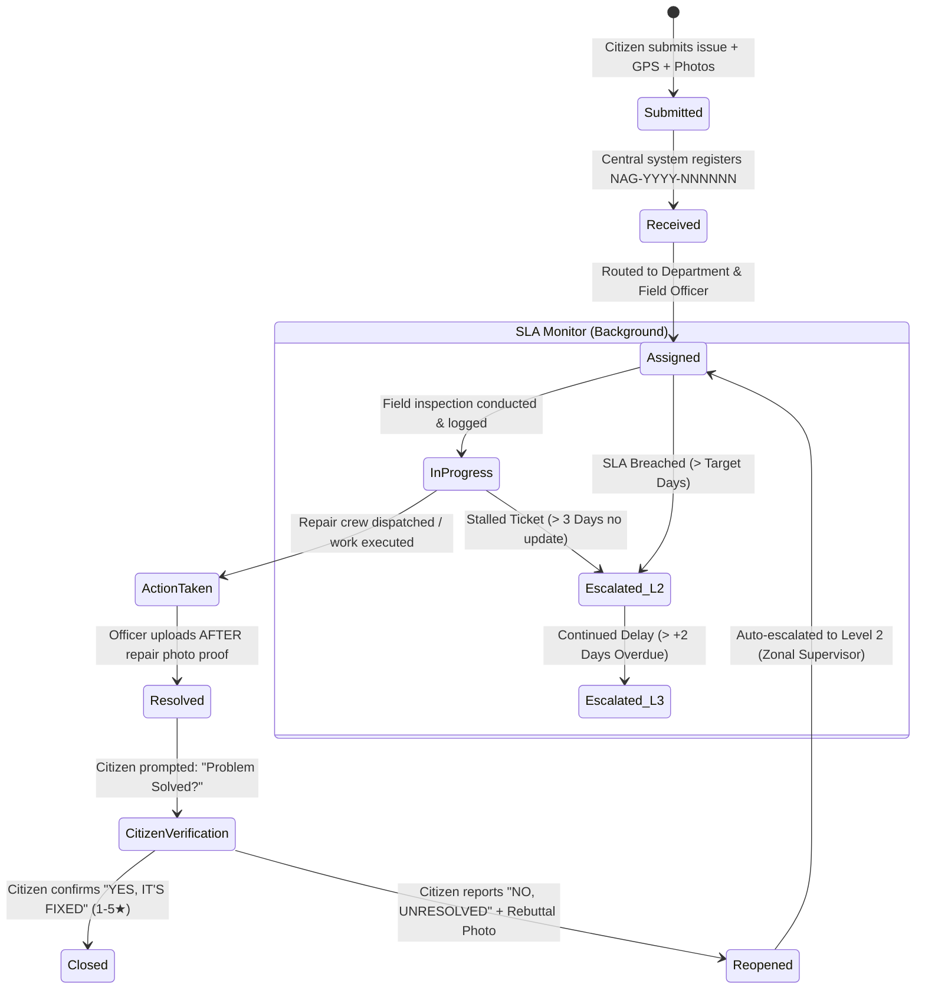
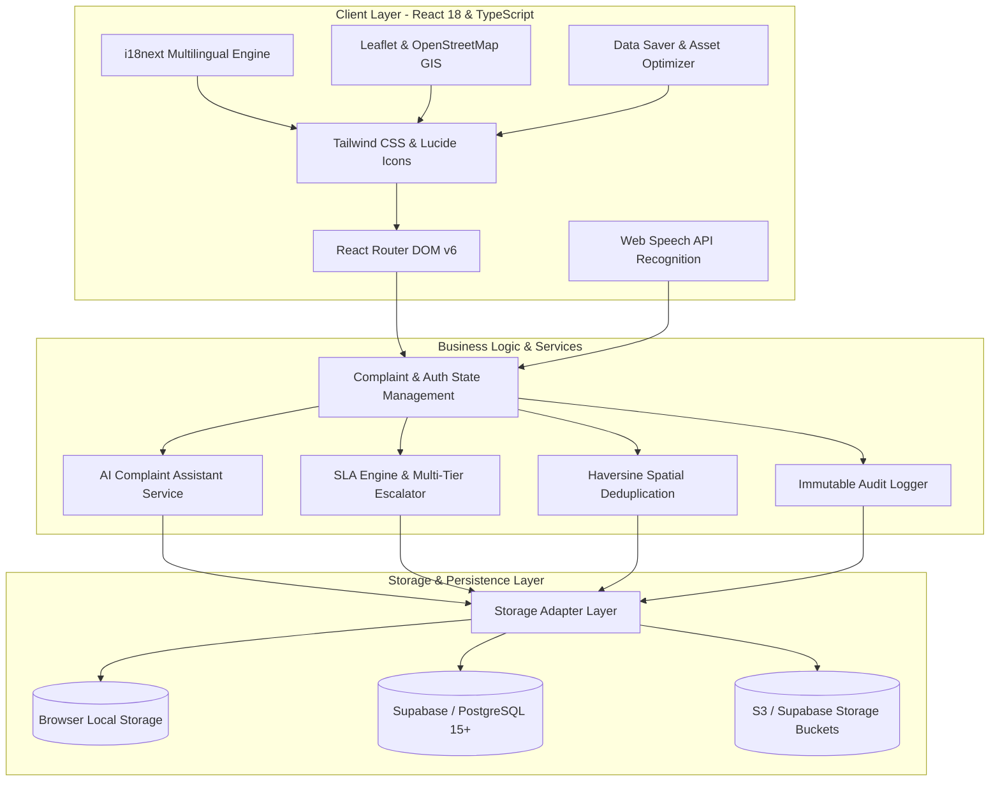
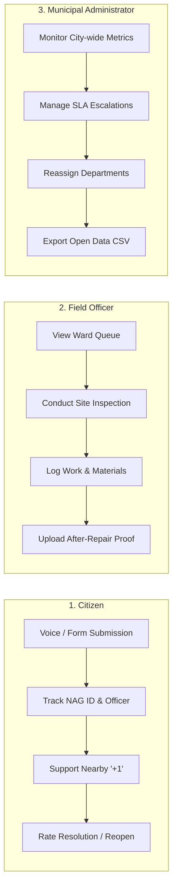
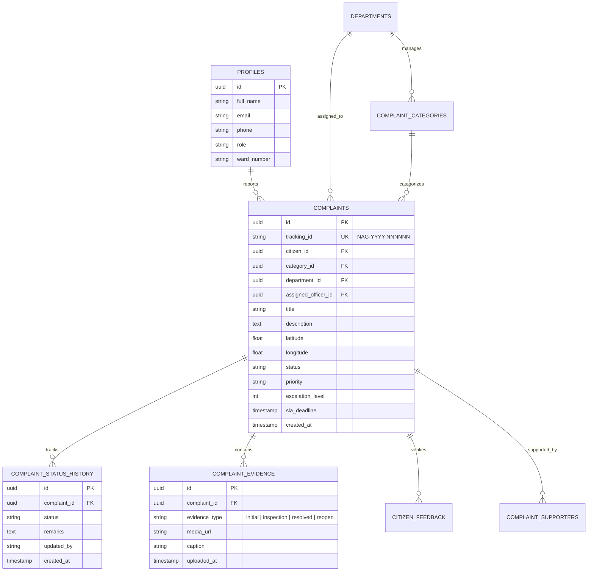

<div align="center">

# 🏛️ NagarSetu (नगर सेतु / నగర సేతు)

### *Your City. Your Voice. Your Right to Know.*

[](https://github.com/bandegangasai/NagarSetu)
[](LICENSE)
[](https://www.typescriptlang.org/)
[](https://reactjs.org/)
[](https://tailwindcss.com/)
[](https://vitejs.dev/)
[](https://vitest.dev/)

<p align="center">
  <b>A transparent, citizen-centric civic grievance redressal and municipal accountability platform.</b><br>
  <i>Empowering citizens to report civic issues, monitor real-time municipal actions, verify physical repairs with photographic evidence, and enforce time-bound SLA accountability.</i>
</p>

[**Explore Live Application**](http://localhost:5173) • [**Report a Problem**](http://localhost:5173/report) • [**Public Issue Map**](http://localhost:5173/map) • [**Transparency Portal**](http://localhost:5173/transparency)

---

</div>

## 📖 Table of Contents

- [🌟 Overview](#-overview)
- [🚨 The Problem](#-the-problem)
- [💡 The NagarSetu Solution](#-the-nagarsetu-solution)
- [✨ Key Features](#-key-features)
- [🔄 Civic Redressal Lifecycle](#-civic-redressal-lifecycle)
- [🏗️ System Architecture](#️-system-architecture)
- [⏱️ Municipal SLA & Escalation Matrix](#️-municipal-sla--escalation-matrix)
- [👥 Role-Based Workflows](#-role-based-workflows)
- [🧠 AI Assistant & Voice Input](#-ai-assistant--voice-input)
- [🗺️ GIS Mapping & Hotspot Detection](#️-gis-mapping--hotspot-detection)
- [📂 Project Directory Structure](#-project-directory-structure)
- [🗄️ Database Schema](#️-database-schema)
- [⚡ Quickstart & Local Setup](#-quickstart--local-setup)
- [🔑 Environment Variables](#-environment-variables)
- [🧪 Testing & Quality Assurance](#-testing--quality-assurance)
- [🔐 Security, Privacy & PII Masking](#-security-privacy--pii-masking)
- [🌐 Multilingual Support](#-multilingual-support)
- [🗺️ Roadmap](#️-roadmap)
- [🤝 Contributing](#-contributing)
- [📄 License & Disclaimer](#-license--disclaimer)

---

## 🌟 Overview

**NagarSetu** (*"Bridge for the City"*) is an open-source civic technology platform engineered to bridge the trust and communication gap between citizens and municipal corporations across India. 

Unlike traditional black-box complaint portals where grievances disappear into administrative backlogs, NagarSetu provides **end-to-end auditability**, **before-and-after photographic verification**, and **citizen-driven resolution sign-off**.

```
[ Citizen Reports Issue ] ➔ [ Auto Department Routing ] ➔ [ Field Inspection & Action ] 
                                                                    │
[ Citizen Verification ] ◄── [ Before / After Photo Proof ] ◄───────┘
         │
         ├──► [ Confirmed Fixed ] ➔ Ticket Closed (1-5★ Rating)
         └──► [ Unresolved ]     ➔ Auto-Escalated with Rebuttal Photo
```

---

## 🚨 The Problem

In Indian Urban Local Bodies (ULBs) and Municipal Corporations, citizens face persistent roadblocks when reporting day-to-day civic issues:

1. **Lack of Confirmation & Identity**: Citizens rarely receive persistent, searchable identifiers or confirmation that their report reached the right department.
2. **Administrative Opacity**: Citizens cannot see which municipal wing (Sanitation, Electrical, Roads, Water) or designated engineer is accountable.
3. **No Field Progress Visibility**: Zero visibility into site visits, material procurement, or scheduled road repairs.
4. **Unexplained Delays**: Complaints breach deadlines without official reasons or updated ETAs provided to the community.
5. **Premature "Paper Resolutions"**: Tickets are frequently marked "Closed" or "Resolved" in official portals without actual on-ground work.

---

## 💡 The NagarSetu Solution

NagarSetu re-engineers municipal governance into an **open, verifiable, and citizen-governed loop**:

* 🆔 **Deterministic Tracking Codes (`NAG-YYYY-NNNNNN`)**: Every report receives an immutable tracking ID (e.g. `NAG-2026-000123`).
* 📜 **Immutable Action Audit Trail**: Permanent timeline capturing every status change, inspection note, and dispatch log.
* 📸 **Before & After Evidence Gallery**: Compulsory side-by-side photographic proof comparing initial citizen photos with completed official repair photos.
* ✅ **Citizen Verification Loop**: A ticket is only considered truly resolved when the citizen clicks **"YES, IT'S FIXED"** or a community verification consensus is reached.
* 🚨 **Multi-Tier Automated Escalation**: Overdue or disputed complaints automatically escalate from Field Officer (L1) to Zonal Supervisor (L2) and Municipal Commissioner (L3).
* 👥 **Spatial Deduplication ("+1 Me Too")**: Haversine geographic clustering (within 300m) allows neighbors to upvote existing issues rather than flooding municipal queues with duplicate tickets.

---

## ✨ Key Features

| Feature | Description |
| :--- | :--- |
| 📝 **5-Step Report Wizard** | Guided workflow with automated GPS pin-drop, landmark detection, urgency scoring, and photo upload. |
| 🎤 **Voice Complaint Input** | Native speech-to-text powered by the Web Speech API supporting spoken English, Telugu (`te-IN`), and Hindi (`hi-IN`). |
| 🤖 **Smart AI Assistant** | NLP heuristics and classification service that automatically identifies problem category, responsible department, and SLA urgency. |
| 🔍 **Public Complaint Tracker** | Public dossier showing assigned department, field engineer name, phone, SLA countdown, and full audit logs. |
| ⏳ **Delay Transparency Card** | Displays official reason for delay, overdue duration, next municipal action, and revised ETA whenever an SLA is breached. |
| 📸 **Evidence Verification** | Side-by-side comparison gallery showing original damage vs. completed repair with officer remarks. |
| 🗺️ **GIS OpenStreetMap Portal** | Interactive map with ward filters, priority color-coding, and GPS location centering. |
| 🔥 **Civic Issue Heatmap** | Dynamic density overlay highlighting infrastructure hotspot clusters requiring macro-level municipal intervention. |
| 📊 **Open Data Transparency** | Public metrics dashboard displaying department resolution rates, average turnaround time, and SLA compliance. |
| ⚡ **Data Saver Mode** | Low-bandwidth toggle that compresses image previews and minimizes network overhead for 2G/3G mobile networks. |
| 🌐 **Trilingual i18n** | Full native support for conversational English, Telugu (తెలుగు), and Hindi (हिन्दी). |

---

## 🔄 Civic Redressal Lifecycle



---

## 🏗️ System Architecture



---

## ⏱️ Municipal SLA & Escalation Matrix

NagarSetu enforces strict service level benchmarks based on standard urban civic charters:

| Category | Responsible Department | Priority | Target SLA | L1 Assignee | L2 Escalation | L3 Escalation |
| :--- | :--- | :---: | :---: | :--- | :--- | :--- |
| **Open Manhole** | Drainage & Sewerage | 🔴 Urgent | **24 Hours** | Ward Sanitary Inspector | Zonal Executive Engineer | Municipal Commissioner |
| **Dead Animal Removal** | Public Health & Sanitation | 🔴 Urgent | **24 Hours** | Sanitation Supervisor | Chief Health Officer | Municipal Commissioner |
| **Garbage Overflow** | Solid Waste Management | 🟠 High | **24 Hours** | Ward Sanitation Officer | Zonal Health Officer | Additional Commissioner |
| **Water Supply Contamination** | Water Works Wing | 🟠 High | **48 Hours** | Assistant Engineer (Water) | Executive Engineer (Water) | Chief Engineer |
| **Street Light Failure** | Electrical Wing | 🟡 Medium | **3 Days** | Ward Linesman / Electrician | Assistant Executive Engineer | Superintending Engineer |
| **Pothole / Road Damage** | Roads & Infrastructure | 🟡 Medium | **7 Days** | Junior Engineer (Civil) | Executive Engineer (Roads) | Chief Engineer (Civil) |
| **Encroachment & Footpath** | Town Planning Wing | 🔵 Normal | **10 Days** | Town Planning Officer | Assistant City Planner | Zonal Commissioner |

---

## 👥 Role-Based Workflows



---

## 🧠 AI Assistant & Voice Input

### 1. Multilingual Speech Recognition (Web Speech API)
- Citizens can report grievances verbally by pressing **"🎤 Start Speaking"**.
- Built-in speech recognition handles English (`en-IN`), Telugu (`te-IN`), and Hindi (`hi-IN`).
- Automatic transcript normalization with 1-click auto-fill into complaint descriptions.

### 2. Smart Category & Priority Classifier
- Natural language analysis parses symptoms (e.g., *"water is dirty and smelling bad"* ➔ `Water Supply`, `High Priority`, `Water Works Department`).
- Extensible client-side NLP heuristics with direct interface support for **Google Gemini 1.5 Flash** for multimodal image analysis and automated description refinement.

---

## 🗺️ GIS Mapping & Hotspot Detection

* **Spatial Proximity Detection**: Employs the **Haversine Formula** to compute distance between newly submitted complaints and active tickets:
  $$\text{distance} = 2r \arcsin\left(\sqrt{\sin^2\left(\frac{\Delta \phi}{2}\right) + \cos(\phi_1)\cos(\phi_2)\sin^2\left(\frac{\Delta \lambda}{2}\right)}\right)$$
* If an existing ticket exists within **300 meters** of the same category, citizens are prompted to support (`+1 Me Too`) rather than create duplicate entries.
* **Heatmap Overlay**: Public map computes geographic density clusters, allowing urban planners to pinpoint chronic pipeline leaks or recurring garbage dump zones.

---

## 📂 Project Directory Structure

```text
nagarsetu/
├── .github/                      # CI/CD workflows and issue templates
├── database/
│   └── schema.sql                # Complete PostgreSQL 15+ relational schema & RLS rules
├── public/                       # Static public assets & icons
├── src/
│   ├── __tests__/                # Automated Vitest test suite
│   │   ├── authContext.test.tsx
│   │   ├── complaintContext.test.tsx
│   │   ├── complaintLifecycle.test.ts
│   │   ├── duplicateDetector.test.ts
│   │   └── slaEngine.test.ts
│   ├── components/
│   │   ├── admin/                # Administrator management panels & SLA dashboards
│   │   ├── common/               # Civic awareness guide, UI cards, modals, alerts
│   │   ├── complaints/           # Evidence gallery, verification modals, timeline
│   │   ├── forms/                # 5-step complaint wizard & voice input module
│   │   ├── layout/               # Navbar, footer, low-bandwidth mode switch
│   │   ├── maps/                 # Leaflet GIS issue map & density heatmap
│   │   └── officer/              # Field officer inspection & resolution forms
│   ├── context/                  # React Context providers (Auth, Complaint state)
│   ├── data/                     # Seed datasets, municipal departments, categories
│   ├── i18n/                     # Trilingual locale dictionaries (en, te, hi)
│   ├── pages/                    # Core application pages and views
│   │   ├── AdminDashboardPage.tsx
│   │   ├── ComplaintDetailPage.tsx
│   │   ├── HomePage.tsx
│   │   ├── OfficerDashboardPage.tsx
│   │   ├── PublicMapPage.tsx
│   │   ├── ReportComplaintPage.tsx
│   │   ├── TrackComplaintPage.tsx
│   │   └── TransparencyPage.tsx
│   ├── services/                 # AI Assistant, Gemini client, storage adapters
│   ├── types/                    # TypeScript interfaces and domain models
│   ├── utils/                    # SLA calculator, Haversine math, PII maskers
│   ├── App.tsx                   # Top-level application routes & layout
│   └── main.tsx                  # Application bootstrap entry point
├── .env.example                  # Environment configuration template
├── package.json                  # NPM dependencies and scripts
├── tailwind.config.js            # Tailwind CSS design system tokens
├── tsconfig.json                 # TypeScript compiler configuration
├── vite.config.ts                # Vite build and test configuration
└── README.md                     # Comprehensive product documentation
```

---

## 🗄️ Database Schema

The production relational schema is fully defined in [`database/schema.sql`](database/schema.sql):



---

## ⚡ Quickstart & Local Setup

### Prerequisites
* **Node.js**: `v18.0.0` or higher
* **Package Manager**: `npm` (`v9+`) or `pnpm` / `yarn`
* **Git**: Installed and configured

### 1. Clone the Repository
```bash
git clone https://github.com/bandegangasai/NagarSetu.git
cd NagarSetu
```

### 2. Install Dependencies
```bash
npm install
```
*(On Windows PowerShell, use `npm.cmd install`)*

### 3. Setup Environment Variables
```bash
cp .env.example .env
```

### 4. Run Development Server
```bash
npm run dev
```
Open your browser at **`http://localhost:5173`**.

---

## 🔑 Environment Variables

| Variable | Description | Required | Default / Example |
| :--- | :--- | :---: | :--- |
| `VITE_SUPABASE_URL` | Supabase Project URL | Optional | `https://your-project.supabase.co` |
| `VITE_SUPABASE_ANON_KEY` | Supabase Public Anonymous API Key | Optional | `eyJhbGciOi...` |
| `VITE_GEMINI_API_KEY` | Google Gemini API Key for AI features | Optional | `AIzaSy...` |
| `VITE_SMS_GATEWAY_URL` | SMS Gateway webhook endpoint | Optional | `https://sms.example.com/send` |
| `VITE_WHATSAPP_API_URL` | WhatsApp Business API endpoint | Optional | `https://graph.facebook.com/v19.0/...` |

> *Note: NagarSetu includes a robust in-memory mock storage engine with seed data. It runs 100% out of the box without requiring external database credentials.*

---

## 🧪 Testing & Quality Assurance

NagarSetu maintains strict code quality with Vitest and React Testing Library:

```bash
# Run unit and integration test suite
npm run test

# Run tests with coverage report
npm run test -- --coverage

# Run TypeScript typecheck and production build
npm run build
```

### Verified Test Suites:
- ✅ `src/__tests__/duplicateDetector.test.ts` — Spatial clustering & duplicate suppression
- ✅ `src/__tests__/slaEngine.test.ts` — SLA deadline computation & multi-tier auto-escalation
- ✅ `src/__tests__/complaintLifecycle.test.ts` — State transitions, audit logging, citizen verification & reopening
- ✅ `src/__tests__/authContext.test.tsx` — Role-based authorization & session switching
- ✅ `src/__tests__/complaintContext.test.tsx` — State provider persistence & real-time updates

---

## 🔐 Security, Privacy & PII Masking

1. **Automatic Citizen PII Masking**:
   - Citizen phone numbers, emails, and full names are masked in all public map popups, recent feeds, and open data exports (e.g. `Ramesh K. (***-1234)`).
2. **Immutable Audit Trails**:
   - Status updates are append-only. History records cannot be modified or deleted by officers or admins.
3. **Role-Based Access Control (RBAC)**:
   - Route guards and role checks prevent unauthorized officers from manipulating complaints outside their assigned ward/department.
4. **Content Security & Safe Media**:
   - Evidence photos are checked for file signatures and sanitized before preview rendering.

---

## 🌐 Multilingual Support

NagarSetu is built with i18next for complete cultural and linguistic accessibility across Indian states:

| Language | Code | Native Name | Sample Action Translation |
| :--- | :---: | :--- | :--- |
| **English** | `en` | English | *"Report a Problem"* • *"Track Complaint"* • *"Problem Solved?"* |
| **Telugu** | `te` | తెలుగు | *"సమస్యను తెలియజేయండి"* • *"ఫిర్యాదు స్థితి"* • *"సమస్య పరిష్కరించబడిందా?"* |
| **Hindi** | `hi` | हिन्दी | *"समस्या की शिकायत करें"* • *"शिकायत की स्थिति"* • *"क्या समस्या हल हो गई?"* |

---

## 🗺️ Roadmap

- [x] **Phase 1: Foundation & Core Reporting** (GPS Pin-Drop, `NAG-YYYY-NNNNNN` Generator, GIS Map)
- [x] **Phase 2: Transparency & Verification** (Immutable Timeline, Before/After Gallery, Citizen Sign-Off)
- [x] **Phase 3: Intelligence & Inclusivity** (Trilingual Localization, Web Speech Voice Input, AI Assistant)
- [ ] **Phase 4: Low-Tech Access** (Automated WhatsApp Grievance Bot & IVR Phone Line integration)
- [ ] **Phase 5: Smart City Interoperability** (Open Government Data (OGD) API adapters & municipal ERP sync)

---

## 🤝 Contributing

Contributions make the open-source community an inspiring place to learn, inspire, and create. Any contributions to NagarSetu are **greatly appreciated**.

1. Fork the Project
2. Create your Feature Branch (`git checkout -b feature/CivicInnovation`)
3. Commit your Changes (`git commit -m 'feat: add automated SMS notification hook'`)
4. Push to the Branch (`git push origin feature/CivicInnovation`)
5. Open a Pull Request

---

## 📄 License & Disclaimer

Distributed under the **MIT License**. See [`LICENSE`](LICENSE) for more information.

> [!NOTE]
> **Independent Civic-Tech Disclaimer**: NagarSetu is an independent civic-tech platform prototype developed for academic, demonstration, and technological innovation purposes. It is not an official municipal corporation portal. All officer names and municipal wards in the default seed database are illustrative.

---

<div align="center">
  <p><b>Built with ❤️ for Transparent & Accountable Indian Cities.</b></p>
  <p>© 2026 NagarSetu Project. Open Source Software.</p>
</div>
