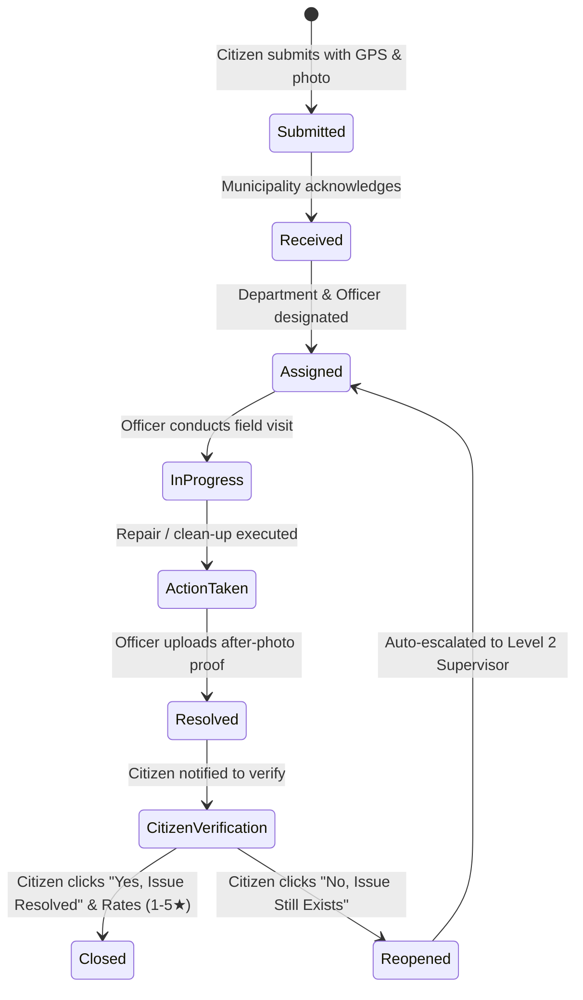

# NagarSetu Architecture Documentation

**Tagline**: *Your City. Your Voice. Your Right to Know.*  
**Product Motto**: *Report a Problem. Track the Action.*

---

## 1. Architectural Philosophy

NagarSetu is designed around the principle of **radical transparency and public accountability in civic governance**. In traditional municipal grievance mechanisms, complaints often fall into black holes where citizens do not know who received their report, what actions are taken, why delays occur, or if the reported resolution is verified.

NagarSetu solves this through:
1. **Unambiguous Ownership**: Every complaint is explicitly assigned to a responsible municipal department and designated field officer with visible contact/designation information.
2. **Immutable Progress Timeline**: Every status update, field inspection note, and escalation is permanently appended to an audit log.
3. **Mandatory Proof-of-Action**: Officers must provide after-resolution photos and descriptions before marking an issue resolved.
4. **Citizen-Driven Verification Loop**: A complaint is not deemed closed until the reporting citizen confirms that the issue has indeed been resolved on the ground. If not, one-click reopening automatically triggers escalation.
5. **Geographic Duplicate Deduplication**: Real-time proximity checking prevents clutter while allowing neighbors to "+1 / Support" the same issue, raising its priority organically.

---

## 2. High-Level Architecture

```text
+-------------------------------------------------------------------------+
|                              CITIZEN UI                                 |
|  - Multi-step Grievance Reporting (GPS / Photo / Category)             |
|  - Visual Lifecycle Timeline with Audit Logs                           |
|  - Citizen Verification & Rating Workflow                               |
|  - Multilingual Engine (English, Telugu, Hindi)                         |
+-------------------------------------------------------------------------+
                                    |
+-------------------------------------------------------------------------+
|                       OFFICER & ADMIN COMMAND HUBS                      |
|  - Field Officer Queue (Inspection / Action / Proof-of-Work Upload)     |
|  - Admin Command Center (SLA Breach Alerts, Auto-Escalations L1-L3)    |
|  - Public Open Data Transparency Portal & Heatmap Analytics            |
+-------------------------------------------------------------------------+
                                    |
+-------------------------------------------------------------------------+
|                             SERVICE LAYER                               |
|  - SLA Engine (Real-time Overdue Days & Automatic Tier Escalation)      |
|  - Duplicate Detection Engine (Haversine Distance <= 250m)             |
|  - Notification Dispatcher (In-app, Extensible SMS/WhatsApp Webhooks)   |
|  - Analytics & SLA Performance Leaderboards                             |
+-------------------------------------------------------------------------+
                                    |
+-------------------------------------------------------------------------+
|                           DATA STORAGE LAYER                            |
|  - PostgreSQL / Supabase Schema (15+ Tables, Triggers, Views)          |
|  - Row Level Security (RLS) & PII Sanitization Policies                 |
|  - Local Resilient Storage Adapter (Instant Demo / Offline Capability)  |
+-------------------------------------------------------------------------+
```

---

## 3. Core Workflow State Machine



---

## 4. SLA & Escalation Hierarchy

| Level | Responsible Authority | Trigger Condition |
| :--- | :--- | :--- |
| **Level 1** | Designated Ward Field Officer | New complaint assigned; active within standard category SLA (e.g. 24h for Garbage, 7 days for Potholes). |
| **Level 2** | Department Zonal Supervisor | SLA deadline breached by $\ge 1$ day, or complaint reopened once by citizen. |
| **Level 3** | Municipal Commissioner / Grievance Cell | SLA breached by $\ge 3$ days, or reopened $\ge 2$ times, or critical life-safety hazards. |

---

## 5. Security & Privacy Guarantees

1. **PII Masking on Public Interfaces**: In all public map views, search results, and transparency feeds, citizen phone numbers, email addresses, and home addresses are completely masked.
2. **Role-Based Access Control (RBAC)**:
   - Field Officers can only update complaints routed to their department/ward.
   - Citizens can only perform verification or reopening on complaints they originally filed.
   - Admins hold overarching operational controls (reassigning, configuring category SLAs).
3. **Data Integrity & Immutability**: All timeline changes are stored in an append-only `complaint_status_history` table preventing retroactive tampering with municipal response dates.
